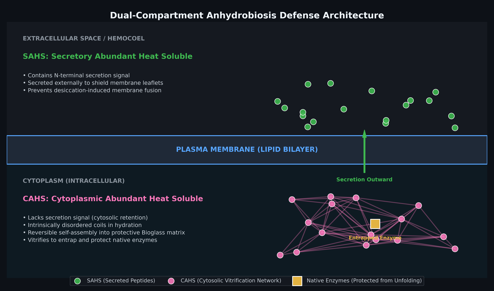

# Tardigrade-stress-seq: anhydrobiosis RNA-seq pipeline & biophysical classifier

an automated, reproducible computational pipeline for quantifying, statistically testing, and biophysically classifying desiccation-induced vitrification genes (**TDPs**, **CAHS**, **SAHS**) in *Hypsibius exemplaris*.



---

## background

during severe desiccation, *Hypsibius exemplaris* vitrifies its intracellular and extracellular space using **Tardigrade Disordered Proteins (TDPs)**. These proteins are divided into two main localization programs:
- **CAHS (Cytoplasmic Abundant Heat Soluble):** Cytosolic glass-formers that lack secretory signals and prevent protein denaturation via amorphous matrix self-assembly.
- **SAHS (Secretory Abundant Heat Soluble):** Secreted proteins bearing an N-terminal signal peptide that protect phospholipid bilayers from osmotic collapse.

this repository processes paired-end RNA-seq cohorts from **Boothby et al. (2017)** (*Molecular Cell*):
- **hydrated controls:** `SRR3727515`, `SRR3727516`
- **desiccated specimens:** `SRR3727517`, `SRR3727518`

---

## pipeline

1. **data acquisition:** Streams raw paired-end reads directly from NCBI SRA via `fastq-dump`.
2. **QC, adapter trimming:** Automated adapter detection and Q20/Q30 quality filtering using `fastp` and `MultiQC`.
3. **quasi-mapping & quantification:** Selective-alignment quantification using `Salmon` indexed against the *H. dujardini* Transcriptome Shotgun Assembly (TSA).
4. *differential expression analysis:** Log2 Fold Change calculations with Welch's unequal variance $t$-tests and Benjamini-Hochberg FDR correction.
5. **biophysical screening:** 6-frame Open Reading Frame (ORF) translation, Isoelectric Point ($\text{pI}$), Molecular Weight, Aromaticity disorder estimation, and Signal Peptide classification.

---

## identified biomarkers

| Transcript ID | Contig Accession | Log2FC | pI | Aromaticity | Secretion Signal | Assigned Classification |
| :--- | :--- | :---: | :---: | :---: | :---: | :--- |
| **`GBZR01011776.1`** | `Hduj_v1_tr_11787` | **+18.49** | 8.95 | 0.050 | Absent | **CAHS (Cytosolic Vitrification Matrix)** |
| **`GBZR01007799.1`** | `Hduj_v1_tr_07806` | **+16.70** | 10.31 | 0.081 | Present | **SAHS (Secreted Membrane Shield)** |
| **`GBZR01000616.1`** | `Hduj_v1_tr_00616` | **+13.52** | 9.58 | 0.085 | Absent | **TDP Stress Mediator (Cationic Chaperone)** |
| **`GBZR01011008.1`** | `Hduj_v1_tr_11015` | **+4.43** | 5.82 | 0.098 | Absent | **Acidic Disordered Linker Factor** |
| **`GBZR01012413.1`** | `Hduj_v1_tr_12425` | **+3.80** | N/A | N/A | N/A | **28S Ribosomal RNA Scaffold** |

---

## rproduction

```bash
# Upstream streaming, QC & quantification
bash run_pipeline.sh

# Differential expression analysis
python analyze_and_annotate.py

# Biophysical classification
python classify_candidates.py

# Mechanism visualization
python generate_mechanism_fig.py

## references
Boothby, T. C. et al. (2017). Tardigrades Use Intrinsically Disordered Proteins to Survive Desiccation. Molecular Cell, 65(6), 975–984. DOI: 10.1016/j.molcel.2017.02.018
Yamaguchi, A. et al. (2012). Two Novel Heat-Soluble Protein Families Abundantly Expressed in an Anhydrobiotic Tardigrade. PLOS ONE, 7(8), e44209. DOI: 10.1371/journal.pone.0044209
